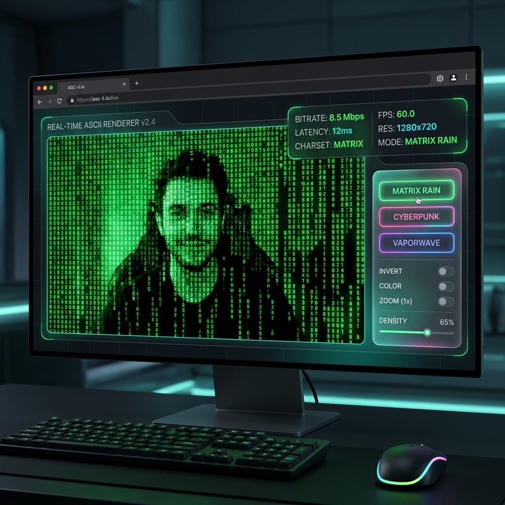

# 📸 ASCII CAM — Live Render Studio



A high-performance, real-time ASCII art webcam renderer built with Vite and TypeScript. Transform your live video feed into stunning ASCII visuals with multiple render modes, color themes, and audio reactivity.

## ✨ Features

- 🎭 **7 Unique Render Modes**: Classic, Matrix Rain, Edge Detection, Emoji, Braille HD, Custom Text, and Thermal.
- 🌈 **5 Premium Color Themes**: Matrix Green, Cyberpunk, Vaporwave, Fire, and Monochrome.
- 🎤 **Audio Reactivity**: Visuals that pulse and respond to your microphone's input.
- ⚡ **High Performance**: Optimized rendering engine for smooth FPS even at high resolutions.
- 📸 **Screenshot Studio**: Capture and save your ASCII masterpieces instantly.
- ⌨️ **Keyboard Shortcuts**: Fully controllable via keyboard for a seamless "terminal-like" experience.

## 🚀 Getting Started

### Prerequisites
- Node.js (v18 or higher)
- A webcam

### Installation
1. Clone the repository:
   ```bash
   git clone https://github.com/solmyst/ascii-camera.git
   cd ascii-camera
   ```
2. Install dependencies:
   ```bash
   npm install
   ```
3. Start the development server:
   ```bash
   npm run dev
   ```

## ⌨️ Controls & Shortcuts

| Key | Action |
|-----|--------|
| `M` | Cycle Render Modes |
| `T` | Cycle Color Themes |
| `G` | Toggle Motion Trails |
| `A` | Toggle Audio Reactivity |
| `I` | Invert Colors |
| `S` | Take Screenshot |
| `↑/↓` | Increase/Decrease Resolution |
| `H` | Toggle Controls Panel |
| `F` | Toggle Fullscreen |

## 🛠️ Deployment

This project is configured for easy deployment to **GitHub Pages**.

1. Ensure the `base` property in `vite.config.ts` matches your repository name:
   ```ts
   base: '/ascii-camera/'
   ```
2. Run the deploy script:
   ```bash
   npm run deploy
   ```
   *This will build the project and push the `dist` folder to the `gh-pages` branch.*

## 🎨 Tech Stack

- **Framework**: [Vite](https://vitejs.dev/)
- **Language**: [TypeScript](https://www.typescriptlang.org/)
- **Styling**: Vanilla CSS (Custom Design System)
- **API**: WebRTC (Camera), Web Audio API

---
Built with ❤️ for the ASCII community.
